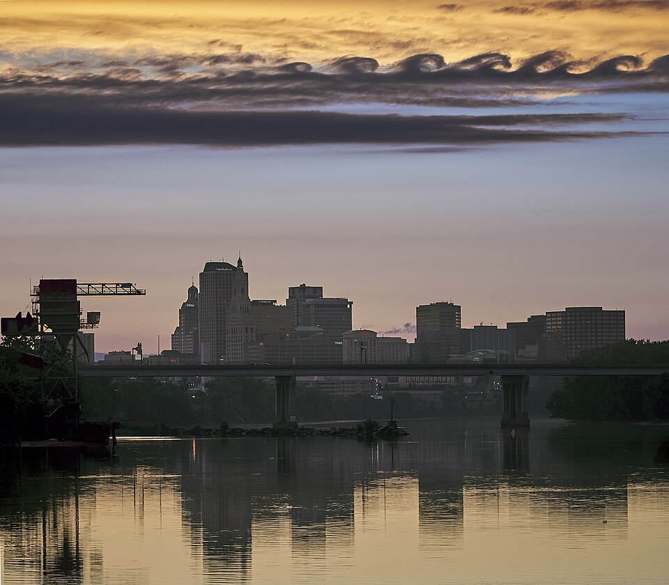
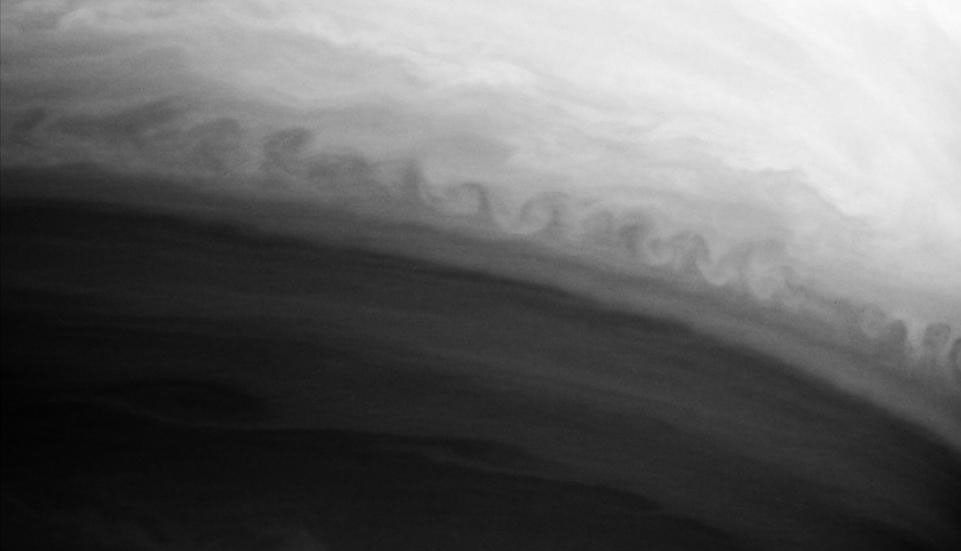

# Kelvin–Helmholtz Instability

When adjacent streams move at different velocities, a small corrugation of their boundary can draw energy from the shear and grow. The initially gentle wave then rolls into a row of billows and vortices—the characteristic signature of the Kelvin–Helmholtz instability.

  <figure class="phenomenon-photo">
    

    <figcaption>Kelvin–Helmholtz clouds above Hartford at sunset, 27 June 2022. Photograph: Paul Danese. <a href="https://commons.wikimedia.org/wiki/File:Kelvin_Helmholtz_cloud_formation_during_Hartford_sunset.jpg">Wikimedia Commons</a>, <a href="https://creativecommons.org/publicdomain/zero/1.0/">CC0 1.0</a>.</figcaption>
  </figure>
  <figure class="phenomenon-photo">
    

    <figcaption>Curling along a boundary between two of Saturn's atmospheric bands, recorded by Cassini's narrow-angle camera on 9 October 2004. Credit: NASA/JPL/Space Science Institute. <a href="https://science.nasa.gov/photojournal/rough-around-the-edges/">Source: NASA Photojournal PIA06502</a>.</figcaption>
  </figure>

NASA identifies the repeating curls along this cloud-band boundary as a Kelvin–Helmholtz pattern. The same mechanism appears across very different scales: in atmospheric cloud layers, oceanic and laboratory shear layers, and the banded atmospheres of giant planets. What matters is not the material itself but the velocity contrast and the dynamical response of a perturbed boundary.

## Visualization

<iframe src="app/index.html?lang=en" title="Kelvin–Helmholtz interface roll-up and linear growth-rate spectrum" data-auto-height scrolling="no" style="display: block; width: 100%; height: 1000px; min-height: 700px; border: 0; overflow: hidden;" loading="eager"></iframe>

### Suggested explorations

1. Start with equal densities and reduce the velocity difference $\Delta U$. Watch the selected mode's growth rate approach zero and the roll-up stop.
2. Increase the interfacial tension $\sigma$, then shorten the wavelength $\lambda$. Move the black point across the cutoff $k_c$ and compare the flow panel before and after the selected mode becomes stable.
3. Vary $\rho_1/\rho_2$ above and below one. The growth rate is unchanged when the ratio is replaced by its reciprocal, but the density-weighted phase speed changes sign.
4. Turn on the tracers. Their colors retain the fluid in which they began, making stretching and interleaving of material visible even when the color boundary becomes thin.

## Linear feedback at a perturbed boundary

Let fluid 1 occupy $y>0$ and fluid 2 occupy $y<0$. Their densities and uniform far-field velocities are $(\rho_1,U_1)$ and $(\rho_2,U_2)$. A normal mode of the initially flat boundary has the form

$$
\eta(x,t)=\eta_0 e^{i(kx-\omega t)}.
$$

The boundary cannot be crossed, so a crest or trough deflects the flow on both sides. The resulting velocity potentials produce pressure perturbations through the linearized unsteady Bernoulli relation,

$$
\delta p_i=-\rho_i(\partial_t+U_i\partial_x)\delta\phi_i.
$$

Because $U_1$ and $U_2$ differ, the two pressure responses need not be in the restoring phase. For one of the two normal-mode branches, the pressure jump raises crests and deepens troughs. Thus boundary displacement, velocity perturbation, and pressure perturbation form a positive feedback loop. This is not fundamentally viscous dragging: the instability is already present in an ideal inviscid fluid.

## Dispersion relation and growth rate

For two inviscid, incompressible, infinitely deep fluids, with the denser fluid below when $\rho_2>\rho_1$, gravity $g$ and interfacial tension $\sigma$ give

$$
\omega=k\bar U\pm\sqrt{
\frac{(\rho_2-\rho_1)gk+\sigma k^3}{\rho_1+\rho_2}
-\frac{\rho_1\rho_2}{(\rho_1+\rho_2)^2}(U_1-U_2)^2k^2
},
\qquad
\bar U=\frac{\rho_1U_1+\rho_2U_2}{\rho_1+\rho_2}.
$$

When the radicand is negative, write $\omega=k\bar U\pm i\gamma$. The growing branch has

$$
\gamma^2=
\frac{\rho_1\rho_2}{(\rho_1+\rho_2)^2}(U_1-U_2)^2k^2
-\frac{(\rho_2-\rho_1)gk+\sigma k^3}{\rho_1+\rho_2}.
$$

In the vortex-sheet limit with $g=\sigma=0$,

$$
\gamma=k\frac{\sqrt{\rho_1\rho_2}}{\rho_1+\rho_2}|U_1-U_2|,
$$

so every $k>0$ is unstable whenever $U_1\ne U_2$, and the growing amplitude behaves as

$$
\eta\propto e^{\gamma t}.
$$

The unbounded increase of $\gamma$ with $k$ is a pathology of an infinitely thin, inviscid vortex sheet. Physical shear layers have a finite thickness, while viscosity, interfacial tension, and compressibility regularize sufficiently small scales.

## Energy source and the vortex-sheet picture

The wave does not create energy. Its source is the kinetic energy stored in the mean velocity gradient. As the instability develops, momentum is exchanged across the layer and the velocity contrast tends to decrease; energy passes from the mean shear into wave and vortical motion, and in a real fluid ultimately into smaller scales and heat.

For the idealized discontinuous profile,

$$
U(y)=
\begin{cases}
U_1,&y>0,\\
U_2,&y<0,
\end{cases}
$$

the spanwise vorticity is concentrated at the boundary:

$$
\omega_z=-\frac{dU}{dy}=-(U_1-U_2)\delta(y).
$$

The boundary is therefore a vortex sheet. A perfectly straight sheet is held by symmetry, but once it bends, the velocity induced by one part displaces other parts asymmetrically. This self-induction strengthens the bend and eventually produces the familiar cat's-eye roll-up.

## Stabilization and finite-thickness shear layers

Stable density stratification supplies a long-wave restoring term proportional to $gk$, whereas interfacial tension supplies a short-wave restoring term proportional to $\sigma k^3$. The visualization sets $g=0$, so its unstable interval and fastest-growing wavenumber are

$$
k_c=\frac{\rho_1\rho_2(U_1-U_2)^2}{\sigma(\rho_1+\rho_2)},
\qquad
0<k<k_c,
\qquad
k_{\mathrm{max}}=\frac{2}{3}k_c,
$$

when $\sigma>0$ and $U_1\ne U_2$. A selected mode with $k>k_c$ has no exponential growth in this model; instead it is a capillary oscillation.

Real velocity profiles are continuous. A common model is

$$
U(y)=U_0\tanh(y/L).
$$

For a two-dimensional inviscid perturbation with phase speed $c=\omega/k$, the amplitude $\phi(y)$ obeys Rayleigh's equation,

$$
(U-c)(\phi''-k^2\phi)-U''\phi=0.
$$

Rayleigh's inflection-point theorem states that a necessary—not sufficient—condition for instability is

$$
U''(y)=0
$$

somewhere in the flow. The hyperbolic-tangent layer has such an inflection point at its center and admits a finite band of unstable wavelengths.

## Conventions and limitations

The interactive spectrum uses dimensionless variables, $\rho_2=1$, symmetric far-field velocities $U_1=+\Delta U/2$ and $U_2=-\Delta U/2$, and a fixed viewport $L_x=8$. Gravity and viscosity are omitted.

The linear growth rate and cutoff are exact for the stated sharp-interface model. The color field is a signed passive scalar transported numerically by a semi-Lagrangian scheme, which introduces some numerical diffusion. To connect linear amplification to an intuitive finite-amplitude picture, the app maps $e^{\gamma t}$ onto a bounded, divergence-free Kelvin–Stuart cat's-eye flow. That construction is schematic: it is not the exact nonlinear initial-value solution of the two-fluid Euler equations, and stable selections are deliberately left at their initial perturbation rather than being shown with a modeled capillary-wave motion.

## References

- NASA Photojournal, [*Rough Around the Edges* (PIA06502)](https://science.nasa.gov/photojournal/rough-around-the-edges/), including the observation details and image credit. See also NASA's [Images and Media Usage Guidelines](https://www.nasa.gov/nasa-brand-center/images-and-media/).
- Paul Danese, [*Kelvin Helmholtz cloud formation during Hartford sunset*](https://commons.wikimedia.org/wiki/File:Kelvin_Helmholtz_cloud_formation_during_Hartford_sunset.jpg), Wikimedia Commons, 27 June 2022, [CC0 1.0](https://creativecommons.org/publicdomain/zero/1.0/).
- Lord Rayleigh, [*On the Stability, or Instability, of Certain Fluid Motions*](https://doi.org/10.1112/plms/s1-11.1.57), *Proceedings of the London Mathematical Society* **s1-11** (1879), 57–72.
- J. T. Stuart, [*On Finite Amplitude Oscillations in Laminar Mixing Layers*](https://doi.org/10.1017/S0022112067000941), *Journal of Fluid Mechanics* **29** (1967), 417–440.
- S. Chandrasekhar, *Hydrodynamic and Hydromagnetic Stability*, Dover (1981), Chapter XI.
